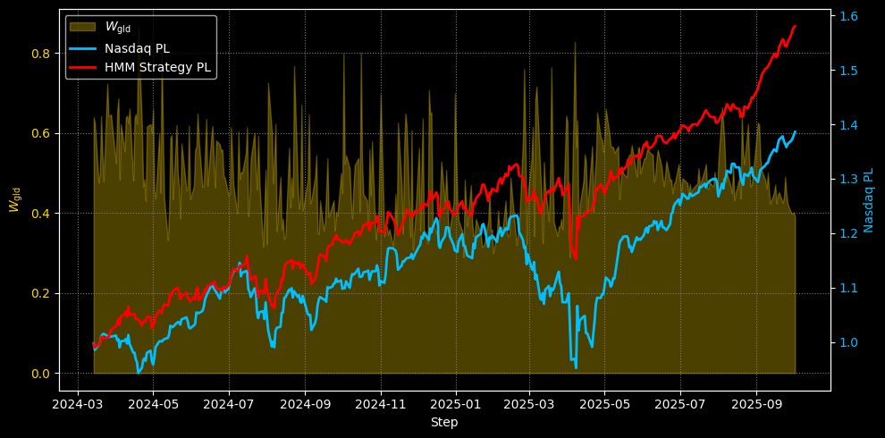

A **Markov process** is a sequence of random variables $\\{ S_t\\}_{t \geq 0}$ that satisfies the following property: 

$$
{P}(S_t | S_{t-1}, S_{t-2}, \dots, S_1) = \{P}(S_t | S_{t-1})
$$

This property states that the probability of transition to the current state $S_t$ depends uniquely on the previous state $S_{t-1}$, and not on the entire past history. This one-step memory makes Markov processes particularly easy to deal with computationally !
A Hidden Markov Model (HMM) is defined by a set of parameters $\lambda$ characterized by: A set of hidden states, for example $S = \\{i, j\\}$; a set of observations, i.e., variables that are not hidden but give us information about the underlying hidden state, 
for example $V = \\{w, u, p\\}$: a transition matrix $A = [a_{ij}]$ with $a_{ij} = P(q_{t+1} = j \mid q_t = i)$, i.e., describing the probabilities of transition from state $i$ to state $j$; 
an emission matrix $B = [b_i(w)]$ with $b_k(o) = P(o_t = w \mid q_t = i)$, i.e., describing the probabilities of observing the visible state $w$ if the hidden state is $i$; an initial probability vector $\pi = [\pi_i, \pi_j]$

In this case, we will model the results with two states, one representing negative log returns and one representing positive log returns. The image below shows an example of how the emission $B$ of states varies: on the left is an example of three states that emit discrete observations, while on the right (the case of the financial market) there are three states that emit continuous (or close to continuous) observations.

The strategy consists of observing a past window of returns (I set a window of 360 trading days) and, based on these, determining the weights of the matrix $A$, which will depend on the time step, therefore $A=A(t)$. These returns determine, from time to time, the best estimate of the state transition probabilities. 

$$
A{(t)} = \begin{bmatrix}
a^{(t)}_{11} & a^{(t)}_{12} \\
a^{(t)}_{21} & a^{(t)}_{22}
\end{bmatrix} = \begin{bmatrix}
P(q_{t+1} = 1 \mid q_t = 1) & P(q_{t+1} = 2 \mid q_t = 1) \\
P(q_{t+1} = 1 \mid q_t = 2) & P(q_{t+1} = 2 \mid q_t = 2)
\end{bmatrix}
$$

Let $\Gamma \in \mathbb{R}^{T \times 2}$ be the posterior probability matrix (gamma matrix), where $\gamma_t^{(i)}$ represents the probability that the system is in state $i$ at time $t$, given the entire set of observations.
The matrix $\Gamma$ has the form:

$$
\Gamma = 
\begin{bmatrix}
\gamma_1^{(1)} & \gamma_1^{(2)} \\
\gamma_2^{(1)} & \gamma_2^{(2)} \\
\gamma_3^{(1)} & \gamma_3^{(2)} \\
\vdots & \vdots \\
\gamma_T^{(1)} & \gamma_T^{(2)} \\
\end{bmatrix}
$$

where for each time $t$:

$$
\gamma_t^{(1)} + \gamma_t^{(2)} = 1
$$

In a discrete-time Markov model, the probability of being in a state at time $t$ depends uniquely on the state at time $t-1$. For this reason, to estimate the probability distribution over states at the next time, it is sufficient to consider the last row of the posterior probability matrix $\Gamma$, that is:

$$
{\gamma}_{t-1} = 
\begin{bmatrix}
\gamma_{t-1}^{(1)} & \gamma_{t-1}^{(2)}
\end{bmatrix}
$$

Where $\gamma_{t-1}^{(i)}$ is the probability of being in state $i$ at time $t-1$.

Let $A(t) \in \mathbb{R}^{2 \times 2}$ be the transition matrix at time $t$, with elements $a_{ij}(t)$, representing the probability of transition from state $i$ to state $j$:

$$
A(t) = 
\begin{bmatrix}
a_{11}(t) & a_{12}(t) \\
a_{21}(t) & a_{22}(t)
\end{bmatrix}
$$

Then, the probability distribution over states at time $t$, denoted by ${\pi}_t$, is obtained by the product:

$$
\pi_t = {\gamma}_{t-1} \cdot A(t)
$$

Explicitly:

$$
\pi_t =
\begin{bmatrix}
\gamma_{t-1}^{(1)} & \gamma_{t-1}^{(2)}
\end{bmatrix}
\begin{bmatrix}
a_{11}(t) & a_{12}(t) \\
a_{21}(t) & a_{22}(t)
\end{bmatrix}=
\begin{bmatrix}
\pi_t^{(1)} & \pi_t^{(2)}
\end{bmatrix}
$$

where:

$$
\pi_t^{(1)} = \gamma_{t-1}^{(1)} a_{11}(t) + \gamma_{t-1}^{(2)} a_{21}(t)
$$

$$
\pi_t^{(2)} = \gamma_{t-1}^{(1)} a_{12}(t) + \gamma_{t-1}^{(2)} a_{22}(t)
$$

For this reason, at time $t$, with the portfolio indicated by $V(t)$, the share of the risky asset indicated by $N(t)$ (N for Nasdaq) and gold indicated by $G(t)$, the portfolio will be composed of 

$$
V(t)= \pi_t^{(1)} N(t) + \pi_t^{(2)} G(t)
$$

The figure below shows the P&L of constant strategies, i.e., only Gold $V(t)=G(t)$ and only Nasdaq $V(t)=N(t)$ (long).

If we consider the mixed strategy with Nasdaq and Gold, $V(t)= \pi_t^{(1)} N(t) + \pi_t^{(2)} G(t)$, this leads to an outperformance of the Nasdaq index. However, this is not surprising, as gold alone beats the index and this strategy relies on gold from time to time depending on the weight assigned by the HMM ($W^t_{\text{GOLD}}=\pi_t^{(2)}$, plot in yellow in the background and axis on the left).

